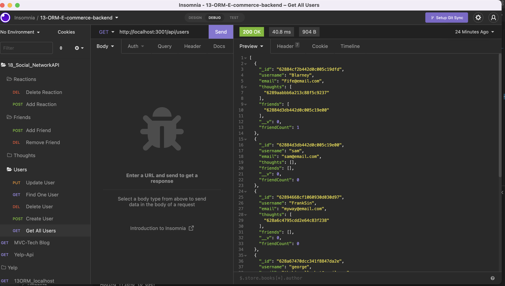

# 18_Robbins_NoSQL_SocialAPI
Unit 18 NoSQL, Social Network API Challenge used with Insomnia.

## Product Description
Using the NoSQL challenge, helps users create a database with express and mongoose.  It lets the users create thoughts and reactions as well as build friendships amongst each other.  

## Table of Contents
- [Utilize the Challenge](#utilize-the-challenge)
- [Screenshot](#screenshot)
- [Run the Program](#run-the-program)
- [Video Walkthrough](#video-walkthrough)
- [Acknowledgements](#acknowledgements)
- [Contact Me](#contact-me)

## Utilize the Challenge
To run the challenge, please open up the integrated terminal, type in npm run start, or I use nodemon.  Utilizing nodemon helps the program continue running and refreshing while asking different commands, and changing aspects of the code.  It will then let you know API server port 3001 is running and you can proceed to Mongodb or Insomnia.  In this challenge, they asked us to use Insomnia.  I already have the folders prepared to get all users, create a user, get one user, update a user and delete a user.  Then you can add thoughts associated with that user.  You can update the thoughts, see all the thoughts created or delete a thought.  You can even add a reaction to a friends thought.  Lastly, you can create friendships.  Link one friend by the :userId/friends/:userId.  All of this is done by using the Create, Read, Update and Delete methods, and in Insomnia, Get, Post, Put and Delete.  

## Screenshot

## Video Walkthrough
[Click for Video Walkthrough](https://drive.google.com/file/d/1C-fxRX8DcgKzOJYhnW0Q4mdc7vCaHh8z/view?usp=sharing)

## Acknowledgements
This challenge could not be possible without the fantastic help from the Instructor and TA's teaching this Unit.  I do feel like this is the most prepared I have been in completing a challenge.  The modules were extremely helpful.  The startup was inciteful for pulling a lot of things together.  I can not finish talking about the staff without commenting on office hours.  The small little things, (sometimes huge), we miss as learning Junior Developers, it is great to have them as a resource and talk us through the assignments.  We are Blessed to have the John, Veronica and Don as our staff members. 

I would also like to thank our class Discord.  There are several of us that utilize this and work through problems and talk through the challenge.  It is great to work together.  We may all do it differently but we work together to make everyone's code work.  There are several people that have a lot of knowledge and they share that knowledge with the rest of us.  I can not thank them enough.  

## Contact Me
- [Github Link](https://github.com/CanRo2B)
- [Github Challenge Link](https://github.com/CanRo2B/18_Robbins_NoSQL_SocialAPI)
- [Email](mailto:hofe36@hotmail.com)
